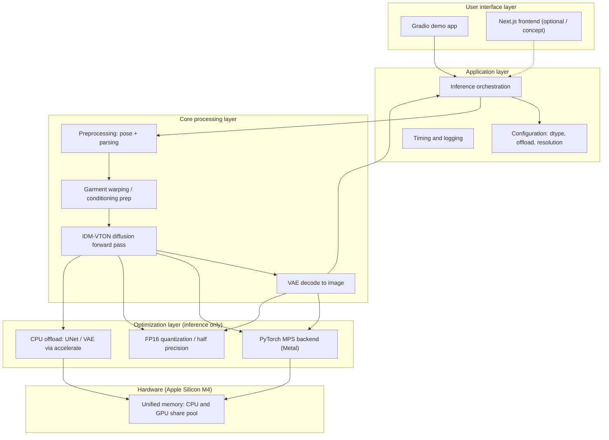

# SiliconVTON — System Architecture

**Project:** SiliconVTON (Virtual Try-On, inference-optimized)  
**Document version:** 1.0  
**Audience:** Technical reviewers, recruiters, internship evaluators  

---

## 1. Executive Summary

**SiliconVTON** is a **local-first** Virtual Try-On (VTON) system that runs pre-trained **IDM-VTON** diffusion weights on a **MacBook Air M4** using **PyTorch** with the **MPS (Metal)** backend. The project is scoped to **inference engineering and optimization**: reducing peak memory and improving **relative** inference latency through **FP16** execution and **CPU offloading** (`accelerate` / `diffusers`), **without** fine-tuning or retraining the base model.

**Value proposition:** Demonstrate that a **state-of-the-art** VTON stack can be executed on **consumer Apple Silicon** by combining Hugging Face–hosted weights, MPS acceleration, and disciplined memory management—useful for **edge demos**, **privacy-sensitive** workflows, and **lower cloud-GPU dependency** for try-on prototypes.

---

## 2. System Architecture Diagrams

### 2.1 Layered architecture

High-level separation of concerns from user interaction down to hardware-backed execution. The **optimization layer** applies **at inference time only** (dtype and memory placement), not via ONNX-centric training or model retraining.

### 2.2 Data flow (end-to-end)

Five logical stages from raw inputs to quality assessment. Exact internal APIs follow the **IDM-VTON** / **diffusers** pipeline; **warping** corresponds to garment alignment and conditioning preparation before the diffusion denoising loop.

**Preprocessing detail:** person + garment images → **MediaPipe** pose → **DeepLabV3** parsing.  
**Quality metrics detail:** **SSIM** and **LPIPS** on output vs reference (evaluation only).

**Stages (concise):**

| Stage | Role |
|--------|------|
| **Preprocessing** | Resize/normalize inputs; extract **pose** (MediaPipe) and **human parsing** (DeepLabV3) to support conditioning and masks. |
| **Warping / alignment** | Prepare warped garment or spatial conditioning as required by **IDM-VTON** before denoising. |
| **Diffusion inference** | Run pre-trained **UNet** (and related modules) over timesteps on **MPS**, optionally with **FP16** and **offloading**. |
| **Decoding** | **VAE** maps latents to output RGB try-on image. |
| **Quality metrics** | **SSIM** and **LPIPS** compare reference and output for **evaluation** (not training loss). |

---

## 3. Technology Stack

| Layer | Technology |
|--------|------------|
| **Language** | Python **3.10+** |
| **ML framework** | **PyTorch 2.4+** with **MPS** enabled |
| **Model serving / diffusion** | **Hugging Face** `diffusers`, `transformers`, **`accelerate`** (offload, device placement) |
| **Vision utilities** | **OpenCV** (`opencv-python`), image I/O and geometry |
| **Evaluation** | **`torchmetrics`** (e.g. SSIM), **LPIPS**-compatible metric (library as integrated in project) |
| **UI** | **Gradio** (primary local demo); **Next.js** noted as an **optional** frontend concept only |
| **Hardware acceleration** | **Apple Silicon GPU** via **PyTorch MPS (Metal)**; **unified memory** supports efficient **CPU↔GPU** movement during **offloading** |

> **Precision:** The primary compute path for this pipeline is **GPU execution through MPS**. Some Apple Silicon components (e.g. Neural Engine) may be used by other system libraries; this architecture document centers on **PyTorch MPS** as the documented acceleration backend for **IDM-VTON** inference.

---

## 4. Core Modules

### 4.1 Preprocessing pipeline

- **MediaPipe Pose:** Lightweight pose estimation for keypoints used in conditioning or auxiliary visualization; chosen to limit RAM versus heavier pose stacks when appropriate.
- **DeepLabV3 (segmentation / parsing):** Human-centric parsing masks to separate regions of interest and support cleaner compositing or conditioning inputs.

Outputs feed the **inference engine** as tensors or masks consistent with the **IDM-VTON** integration (exact tensor shapes are pipeline-version specific).

### 4.2 Inference engine

- **Model:** **IDM-VTON** pre-trained weights (e.g. from Hugging Face); **no** claim of training these weights in this project.
- **Execution:** **UNet** denoising and **VAE** encode/decode orchestrated through **`diffusers`**.
- **Memory strategy:** **`enable_model_cpu_offload()`** or related **`accelerate`** patterns to hold inactive modules on **CPU** and stream layers to **MPS** when needed, trading **latency** for **lower peak GPU-resident memory**.

### 4.3 Optimization module

- **FP16:** Cast or configure the pipeline for **half precision** where numerically stable, reducing activation and weight memory bandwidth versus **FP32**.
- **Memory management:** Batch size **1** for consumer hardware, resolution caps, optional **sequential** offload for extreme memory pressure.
- **Scope:** All optimizations are **inference-time**; **no** retraining loop.

### 4.4 Evaluation module

- **SSIM** and **LPIPS** (or equivalent perceptual metric) computed **between** the input person image (or defined reference) and the **generated try-on** output.
- **Purpose:** **Quality assurance** and **benchmark reporting** for the portfolio—metrics are **not** used here as **training losses**.

---

## 5. Performance and Optimization Strategy

### 5.1 Baseline vs optimized (relative comparison)

| Mode | Description |
|------|-------------|
| **Baseline** | **PyTorch MPS**, **FP32**, full model resident in **unified memory** (maximal peak usage). |
| **Optimized** | **PyTorch MPS**, **FP16**, plus **`enable_model_cpu_offload()`** (and variants if needed) for **UNet** / **VAE**. |

### 5.2 Target claims (relative, hardware-dependent)

On **MacBook Air M4**, the project **targets** approximately:

- **~40%** reduction in **end-to-end inference latency** (optimized vs baseline), and  
- **~50%** reduction in **peak memory footprint** (optimized vs baseline),

**measured on the same inputs and resolution** in a reproducible benchmark script. Actual numbers **vary** with macOS version, PyTorch build, resolution, and pipeline options; the **README** should publish a **measured table** (not hand-waved absolutes).

### 5.3 Honest scope statement

> **Optimization is achieved through inference strategies** (dtype, device placement, offloading, resolution)—**not** through retraining **IDM-VTON** or exporting to **ONNX** as the primary path. **ONNX** may be mentioned elsewhere only as **experimental / optional** if explored; this document **does not** rely on ONNX for the core design.

### 5.4 Terminology

- Use **low-latency** or **optimized inference** relative to the project’s own **FP32** baseline—not **“real-time”** in the **sub-100 ms** sense, which is **not** typical for full diffusion VTON on this hardware.

---

## 6. Deployment Architecture

### 6.1 Local deployment (M4)

- **Runtime:** Single-machine **Python** environment; **Gradio** binds to **localhost** (or a user-specified host) for demo access.
- **Assets:** Pre-trained weights downloaded from **Hugging Face** (or cached locally); **no** training cluster.

### 6.2 Unified memory (Apple Silicon)

- **CPU** and **GPU (MPS)** share the **same physical memory pool**, which benefits **offloading**: moving a module to **CPU** does not copy across discrete GPU VRAM, reducing classical **PCIe** bottlenecks seen on discrete GPUs.
- **Trade-off:** **Offloading** still introduces **synchronization and transfer overhead**; gains are **memory peak** and sometimes **effective throughput** when **FP16** is enabled—not a guarantee of **absolute** minimum latency.

### 6.3 Optional future extension

- A **Next.js** (or similar) **frontend** could call a **local HTTP API** wrapping the same Python inference service; that is **out of scope** for the core internship demo unless explicitly implemented.

---

## 7. Document control

| Item | Status |
|------|--------|
| Model training | **Out of scope** — weights are **pre-trained** |
| Primary backend | **PyTorch MPS** |
| Primary optimizations | **FP16**, **CPU offload** via **`accelerate`** |
| Metrics | **SSIM / LPIPS** for **evaluation only** |

---

*SiliconVTON — Inference engineering on Apple Silicon for a B.Tech IT internship portfolio (e.g. VIT Vellore).*
